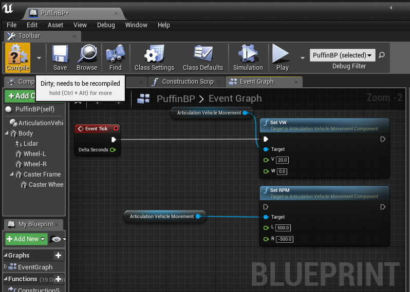

## Unreal Editorでの開発環境の整備

### 事前に必要な物

WindowsでUE4開発をするのに必要な物一式が必要です。

+ EPICGamesのアカウントとUnrealEngine4
+ EPICGamesにリンクした Githubアカウント
+ WindowsでのUE4開発環境(VisualStudio, UnrealEngine4, その他)
+ Windowsでのgithubにアクセスする手段
+ 90GB程のストレージ

### アカウントの準備

1. まず最初にgithubのアカウントをまだ持っていなければ、**(A)**[githubのページ](https://github.com)でgithubアカウントを作成します。
2. 次に[UnrealEngineのページ](https://www.unrealengine.com/ja/feed)に行き、**(B)** EpicGamesのアカウントを作成し、**(C)** ゲームデベロッパーのEULAに同意し、**(D)** UnrealEngineをダウンロード/インストールします。ただ実際にはインストーラがインストールするのはEpic Games Launcherで、Unreal Engineそのもののインストールは手順が必要です(後述)。
3. さらに[Unreal Engineの接続済みアカウントのページ](https://www.unrealengine.com/account/connected)で **(E)** Githubアカウントと接続します。
4. その後[GithubのEpicGamesのページ](https://github.com/EpicGames)に行き、**(F)** InvitationをAcceptします。

上記 **(A)** から **(F)** までうまくいけば、[PxArticulationLink Plugin](https://github.com/yosagi/PxArticulationLink) (及び[Unreal Engineのソースコードリポジトリ](https://github.com/EpicGames/UnrealEngine))にアクセスできるようになります。念のため作成したアカウントでこれらリポジトリにアクセスし、404にならないことを確認してください。

参考リンク

+ [GitHub アカウントと Epic Games アカウントの紐付けの認証プロセスのアップデート](https://www.unrealengine.com/ja/blog/updated-authentication-process-for-connecting-epic-github-accounts)
+ [アンリアル エンジンのインストール方法](http://api.unrealengine.com/JPN/GettingStarted/Installation/index.html)
+ [Installing Unreal Engine](https://docs.unrealengine.com/en-US/GettingStarted/Installation)
+ [GITHUB 経由でアンリアル・エンジン 4 C++ ソースコードにアクセスする方法](https://www.unrealengine.com/ja/ue4-on-github)

### 動作環境の準備

1. [Visual Studio 2019](https://visualstudio.microsoft.com/ja/downloads/)もしくは[Visual Studio 2017](https://docs.microsoft.com/en-us/visualstudio/productinfo/vs2017-system-requirements-vs)をダウンロードしてインストールします。インストーラでは"C++によるデスクトップ開発"にチェックを入れて下さい。既にインストールされている場合は、念のためVisual Studio Installerを起動し、最新版に更新しておきます。
2. git ([Git for windows](https://gitforwindows.org))をインストールします。トラブルを避けるためにできればコマンドラインのgitを使って下さい。

### Unreal Engineのインストール

アカウントの準備 **(D)** ではEpic Games Launcherがインストールされます。実際に使うUnreal Engineのバイナリは別途手順が必要です。

1. Epic Games Launcherを起動し、左のタブからUnreal Engineを選択。
2. 上のタブからライブラリを選択
3. Engineバージョンの右の+をクリックしてEngineスロットを追加。
4. 追加されたスロットのバージョン番号の右にある▼をクリックし、4.25.3を選択。
5. インストールをクリック。

なお、Engineのバイナリは約10GB程あり、ダウンロードにはそこそこ時間がかかります。

### 補足

これらの他、外部プログラムからロボットを動かすには[cage-clientライブラリ](https://github.com/furo-org/CageClient)があると便利です。cage-clientは今のところLinuxで動作するのでこれを動かす環境(実機, WSL, 仮想マシンなど)が必要です。

## セットアップ

以下の手順で進めてください。

1. このリポジトリをclone
2. Plugin の submodule を更新
3. 外部アセットの追加
4. ビルドおよび起動

### クローン

%USERPROFILE%\Documents\Unreal Projects の下にクローンするとトラブルが減るかもしれません。

```
cd %USERPROFILE%"\Documents\Unreal Projects"
git clone https://github.com/furo-org/VTC.git
```

### Pluginのsubmoduleを更新

update_submodule.batを実行してください。もしくは以下のコマンドでも同等です。

```
cd VTC
git submodule update --init --recursive --depth=1
```

これで以下のPluginが取り込まれます。

+ [Cage Plugin](https://github.com/furo-org/CagePlugin)
+ [ZMQUE Plugin](https://github.com/furo-org/ZMQUE)
+ [PxArticulationLink Plugin](https://github.com/yosagi/PxArticulationLink)

(PxArticulationLinkはUnrealEngine Repositoryのフォークなので、'--depth=1'をつけないと大量の不要なオブジェクトをダウンロードしてしまいます。)

### 外部アセットの追加

以下のアセットを一部利用しているので、Epic Games Launcherでこれらをプロジェクトに追加します。

+ [Infinity Blade: Grass lands](https://www.unrealengine.com/marketplace/ja/slug/infinity-blade-plain-lands)

+ [Paragon: Agora と Monolith の背景](https://www.unrealengine.com/marketplace/ja/slug/paragon-agora-and-monolith-environment)

+ [Open World Demo Collection](https://www.unrealengine.com/marketplace/ja/slug/open-world-demo-collection)

+ [Megascans - Asphalt](https://www.unrealengine.com/marketplace/ja/product/dcf1a964e29f4cfb9599af259366db2a)

+ [Megascans - Street Tiles](https://www.unrealengine.com/marketplace/ja/product/e3549bf5c32d4b8386d61fd1629ca608)

具体的には以下の手順を行います。

1. Epic Games Launcherを起動し、Unreal Engine のマーケットプレイスでこれらアセットを"購入"する。もしくは上記リンクから"サインインして購入"する。(購入と表記されますがどれも無料アセットです)
2. Epic Games Launcherを起動し、Unreal Engine のライブラリにある上記アセットを”プロジェクトに追加"する。

これらアセットも合計で50GB程あるので、ダウンロードに時間がかかります。

### ビルドおよび起動

VTC.uprojectをダブルクリックすると必要なモジュールのビルドが走り、成功するとUnreal Editorが起動します。初回の起動時に色々生成するのでPCのスペックによっては、"Loading...95%"という表示のあたりで一時間程度の時間がかかる可能性があります。気長に待ってください。再度Unreal Editorを起動するときもVTC.uprojectをダブルクリックします。二回目以降の起動では初回にビルドしたものが再利用されるので1分かからず起動すると思います。

何らかの原因で起動できなかった場合、Saved/Logs/VTC.logにログが残るので、これを読むと原因がわかるかもしれません。

Visual Studioでソースを参照/編集するにはVTC.uprojectを右クリックして'Generate Visual Studio project files'して下さい。VTC.slnが生成されるので、そこからVisual Studioを起動できます。

なお、PxArticulationLink Pluginには今のところバイナリしか置いていません。リビルドしたりクリーンしたりすると必要なファイルまで消えてビルドできなくなります。その場合Plugins/PxArticulationLinkをcheckoutするなどして元に戻せば再度ビルドできるようになります。

Lightmassが出力するライトマップは再生成できるのでリポジトリには入れていません。そのため、初回起動時にはライトマップのビルドをしたほうが良いでしょう。以下の手順でビルドしてください。

1. Window - Levels (ウィンドウ-レベル) でレベルウィンドウを表示
2. TC_x?_y? をすべて選択して右クリックのコンテキストメニューからロード
3. Build - Build Lighting Only (ビルド-ライティングのみビルド) でビルド

なお、これも多少(10分以上)時間がかかります。

ここまで問題なく済めば、準備完了です。

### エディタの環境設定

Unreal Editorの初期設定では、Editorがフォーカスを失うとCPU使用率を下げてしまい、フレームレートが落ちます。この挙動を避けるにはメニューバー>Edit>Editor Preferences>General>Performance で Use Less CPU when in Background のチェックを外してください。

エディタのUIラベルの言語を変更するには Edit - Editor Preferences - Region & Languages - Editor Language (編集-エディタの環境設定-地域&言語-エディタの言語)を変更します。

### 操作方法

Unreal EditorでAlt-Pを押すか、ツールバーのPlayボタンを押すととシミュレーションが始まります
シミュレーション内ではマネキンを操作して世界に干渉するか、Editorの機能で干渉することができます。
シミュレータの操作は [シミュレータの操作方法](docs/runtime.md) を参照してください。

その他Unreal Editorの具体的な操作方法についてはUnreal Engine4のドキュメント類を参照してください。

### 動作確認

ひとまず外部からのコマンドではなく、ブループリントから車輪を回転させて動作確認します。



1. ワールドアウトライナでPuffinBPを探し、右にあるリンクからPuffinBPを編集します。
2. イベントグラフタブで、Event Tickの白い五角形をSet VWの白い五角形につなぎます。
3. Set VWのWを0に、Vを20程度に変更します。ここでの数値の単位はVがcm/s, Wがdeg/sです。
4. 左上、ツールバーにあるコンパイルボタンを押します。

これで速度20cm/sで走行するコマンドが毎フレーム発行されます。Alt-Pを押してシミュレーションを開始し、Puffinが動くことを確認して下さい。

## トラブルシューティング

### Unreal Editorが起動しない

以下を確認してください

1. submodule 群が正しくチェックアウトできているか
2. エンジンバージョンが動作確認済みのものと同じか

### submodule PxArticulationLink が取得できない

PxArticulationLinkはUE4のリポジトリのフォークとして作っています。そのためEpicのUnrealEngineリポジトリにアクセスできるアカウントでないと404になります。

### 環境がスクリーンショットと比べて色々足りない

必要なアセットをEpic Games Launcherから追加しているか確認してください。
