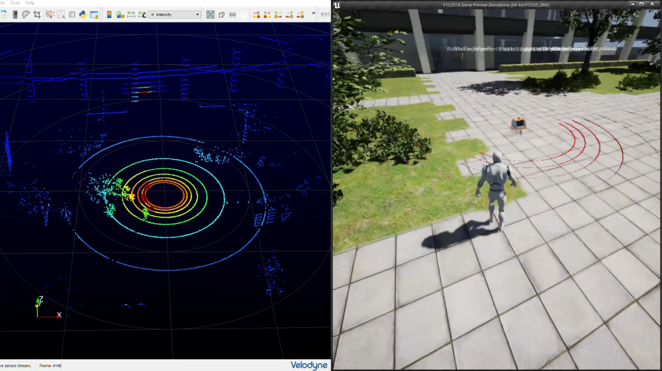

# VTC: Virtual Tsukuba Challenge

つくばチャレンジ 3rd stage の確認走行区間を模擬した環境と、そこで動作する移動ロボットシミュレータ。

## 関連Repository

+ [Cage Plugin](https://github.com/furo-org/CagePlugin): 移動ロボット、センサ等の機能をパッケージしたプラグイン(VTCがサブモジュールとして使用)
+ [ZMQUE Plugin](https://github.com/furo-org/ZMQUE): ZeroMQのdllをロードするプラグイン(VTCがサブモジュールとして使用)
+ [PxArticulationLink Plugin](https://github.com/yosagi/PxArticulationLink): PhysX Articulation APIにアクセスするためのプラグイン(VTCがサブモジュールとして使用)
+ [CageClientライブラリ](https://github.com/furo-org/CageClient): シミュレータ内ロボットと通信し、コマンドを送りステータスを取得するライブラリ(ユーザーが別途入手して利用)
+ [cage_ros_stack](https://github.com/furo-org/cage_ros_stack): CageClientライブラリのROSブリッジ(ユーザーが別途入手して利用)

## 動作環境

以下の環境で動作確認しています。

PC

+ Ryzen7 1800X(3.6GHz) + GeForce GTX 1080
+ Core i7 7700HQ(2.8GHz) + GeForce GTX 1060

ソフトウェア環境

+ Windows 10 1909 64bit
+ Visual Studio 2019 16.5.4
+ Unreal Engine 4.25.4

## ドキュメント

+ [シミュレータの操作方法](docs/runtime.md)
+ [エディタでの開発環境設定](docs/editor.md)

環境を編集したり、シミュレータのコードに手を入れるにはエディタでの開発環境をセットアップする必要があります。既存の環境でロボットを走らせるだけならば、パッケージ済みバイナリと[CageClientライブラリ](https://github.com/furo-org/CageClient)または[cage_ros_stack](https://github.com/furo-org/cage_ros_stack)を使ってください。

## パッケージ済みバイナリのダウンロード

[Releaseページ](https://github.com/furo-org/VTC/releases)よりzipファイルをダウンロードしてください。
展開してVTC.exe(もしくは古いものはVTC2018.exe)を起動するだけなので、各種アカウントの用意やインストールなどをせずに手軽に試せます。全画面とウィンドウモードの切り替えはAlt-Enterで、終了はAlt-F4もしくはEscです。パッケージ版はUnreal Editorで編集することはできませんが、[CageClientライブラリ](https://github.com/furo-org/CageClient)または[cage_ros_stack](https://github.com/furo-org/cage_ros_stack)を使ってコマンドを送ることでロボットを動かすことができますし、lidarのシミュレーションも動きます。

念のため古いバイナリも残しておきます。
+ [VTC 2020/5/28版 Windows 64bit 約1GB](https://1drv.ms/u/s!AkekAlL4McuXlQOBSBVlSNaRIZpQ?e=veg3e0)
+ [VTC2019 Windows 64bit 約750MB](https://chibakoudai-my.sharepoint.com/:u:/g/personal/yoshida_tomoaki_p_chibakoudai_jp/ETDQWwohngxKsu09_ga2H9UBs5A4OmVFnmzQckcgW8upzA?e=IJuMfI)
+ [VTC2018 (以前のバージョン) Windows 64bit 約700MB](https://chibakoudai-my.sharepoint.com/:u:/g/personal/yoshida_tomoaki_p_chibakoudai_jp/ER00YHh9YYFEpBnFCl16Ug4BnmRve_PuS1y1sB2-dvryDw?e=cxDaMb)

## 利用事例

情報をいただいた動作確認例、利用例等を紹介します。

### [Unreal Engineの環境構築から、ROS(LIO-SAM)を使用してマップ作成を行うまで(VTC)](https://beike-re.hatenablog.com/entry/VTC/LIO-SAM/3d-mapping)
#11 で教えていただきました。Thanks @uhobeike 。

## 環境データの出典及び利用条件について

### 国土地理院基盤地図情報に基づくデータ

VTCマップのLandscapeの構築に国土地理院基盤地図情報(基盤地図情報 基本項目及び数値標高モデル(5mメッシュ) 544000,544010)を承認を受けて使用しています。

「測量法に基づく国土地理院長承認（使用）R 2JHs 231」

以下のファイルは基盤地図情報 基本項目をベースに加工して生成したものです。
 + Assets/TC-Asphalt-geo.tif
 + Assets/TC-Pedestrian-geo.tif
 + Assets/TC-Park-Green-geo.tif
 + Assets/TC-Water-geo.tif
 + Assets/TC-Buildings-geo.tif

以下のファイルはこれらファイルからVTCのLandscape Layerに適用できる形にAssets/python_scripts/LayerGen.pyを使って加工したものです

+ Assets/Layer-Asphalt.png
+ Assets/Layer-Park-Green.png
+ Assets/Layer-Pedestrian.png
+ Assets/Layer-Water.png

また次のファイルは数値標高モデル(5mメッシュ)を使って生成したファイルです。
+ Assets/TC-DEM-geo.tif

以下のファイルはこのGeoTiffを入力の一部としてスクリプト(Assets/python_scripts/LandscapeGen.py)で生成したものです。

+ Assets/heightmap.png
+ Assets/heightmap-0909.png

さらにmapファイル群(Content/Maps/VTC2018/TC/TC_x?_y?.umap)にはこれら生成物(地形及び地図情報)がインポートされています。

これらファイル群はその他ファイル群とは利用条件が異なりますので二次利用したい場合などは注意してください。詳しくは[国土地理院のページ](https://www.gsi.go.jp/LAW/2930-qa.html)を参照してください。

### その他データセットに基づくデータ

以下のファイル群は千葉工大fuRoチームが2019年に収集したデータに基づいて作成された点群です。元のデータセットは[別途公開](https://github.com/tsukubachallenge/tc-datasets#tc2019-furo-map-data)していますので、これらファイル群の利用条件も元のデータセットの利用条件([CC-BY-NC-SA-4.0](https://creativecommons.org/licenses/by-nc-sa/4.0/))に従います

+ Content/Maps/Voxel/map_tc19_xxx.uasset

以下のファイルは千葉工大fuRoチームが2020年に収集したデータに基づいて生成された部分を含みます。元のデータセットは別途公開予定です。

+ Assets/heightmap-0909.png

## License

前節で説明した各ファイルについてはそれぞれのライセンスとします。また、以下のモデルデータについては[CC-BY-NC-SA-4.0](https://creativecommons.org/licenses/by-nc-sa/4.0/)とします。

+ Assets/City Hall.fbx
+ Assets/CityHallChair.blend
+ Assets/CityHallChair.fbx
+ Assets/CityHallTable1.blend
+ Assets/CityHallTable1.fbx
+ Assets/CityHallTable2.fbx

VTCのその他特に表記のないものについてはApache2.0とします。ライセンス全文はLICENSEファイルを参照してください。

Copyright [2017-2020] Tomoaki Yoshida <yoshida@furo.org>

Licensed under the Apache License, Version 2.0 (the "License");
you may not use this file except in compliance with the License.
You may obtain a copy of the License at

    http://www.apache.org/licenses/LICENSE-2.0

Unless required by applicable law or agreed to in writing, software
distributed under the License is distributed on an "AS IS" BASIS,
WITHOUT WARRANTIES OR CONDITIONS OF ANY KIND, either express or implied.
See the License for the specific language governing permissions and
limitations under the License.
