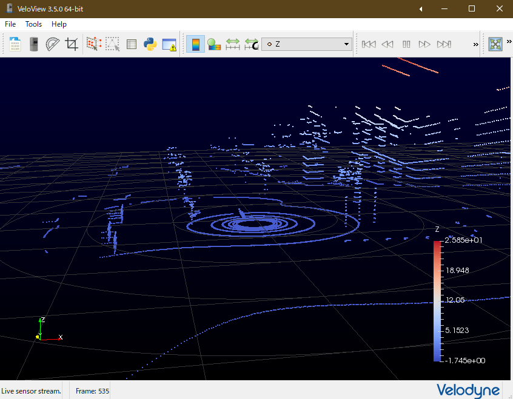

# VTC2018

つくばチャレンジ2018の確認走行区間を模擬した環境。


## 動作環境

以下の環境で動作確認しています。

+ Ryzen7 1800X
+ GeForce GTX 1080
+ Windows 10 1809 64bit
+ Visual Studio 2017 15.9.4
+ Unreal Engine 4.22.2

なお、起動するまでに約50GB程度のストレージが必要となります。

## 関連Repository

+ [Cage Plugin](https://github.com/furo-org/CagePlugin)
+ [ZMQUE Plugin](https://github.com/furo-org/ZMQUE)
+ [PxArticulationLink Plugin](https://github.com/yosagi/PxArticulationLink)
+ [cage-clientライブラリ](https://github.com/furo-org/cage-client)

## 事前に必要な物

WindowsでUE4開発をするのに必要な物一式が必要です。

+ EPICGamesのアカウントとUnrealEngine4
+ EPICGamesにリンクした Githubアカウント
+ WindowsでのUE4開発環境(VS2017, UnrealEngine4, その他)
+ Windowsでのgithubにアクセスする手段
+ 50GB程のストレージ

### アカウントの準備

1. まず最初にgithubのアカウントをまだ持っていなければ、(A)[githubのページ](https://github.com)でgithubアカウントを作成します。
2. 次に[UnrealEngineのページ](https://www.unrealengine.com/ja/feed)に行き、(B)EpicGamesのアカウントを作成し、(C)ゲームデベロッパーのEULAに同意し、(D)UnrealEngineをダウンロード/インストールします。ただ実際にはインストーラがインストールするのはEpic Games Launcherで、Unreal Engineそのもののインストールは手順が必要です(後述)。
3. さらに[Unreal Engineの接続済みアカウントのページ](https://www.unrealengine.com/account/connected)で(E)Githubアカウントと接続します。
4. その後[GithubのEpicGamesのページ](https://github.com/EpicGames)に行き、(F)InvitationをAcceptします。

上記(A)から(F)までうまくいけば、[Unreal Engineのソースコードリポジトリ](https://github.com/EpicGames/UnrealEngine)にアクセスできるようになります。


参考リンク

+ [GitHub アカウントと Epic Games アカウントの紐付けの認証プロセスのアップデート](https://www.unrealengine.com/ja/blog/updated-authentication-process-for-connecting-epic-github-accounts)
+ [アンリアル エンジンのインストール方法](http://api.unrealengine.com/JPN/GettingStarted/Installation/index.html)
+ [Installing Unreal Engine](https://docs.unrealengine.com/en-US/GettingStarted/Installation)
+ [GITHUB 経由でアンリアル・エンジン 4 C++ ソースコードにアクセスする方法](https://www.unrealengine.com/ja/ue4-on-github)

### 動作環境の準備

1. [Visual Studio 2017](https://docs.microsoft.com/en-us/visualstudio/productinfo/vs2017-system-requirements-vs)をダウンロードしてインストールします。インストーラでは"C++によるデスクトップ開発"にチェックを入れて下さい。既にインストールされている場合は、念のためVisual Studio Installerを起動し、最新のVisual Studio 2017に更新しておきます。
2. git ([Git for windows](https://gitforwindows.org))をインストールします。トラブルを避けるためにできればコマンドラインのgitを使って下さい。

### Unreal Engineのインストール

アカウントの準備(D)ではEpic Games Launcherがインストールされます。実際に使うUnreal Engineのバイナリは別途手順が必要です。

1. Epic Games Launcherを起動し、左のタブからUnreal Engineを選択。
2. 上のタブからライブラリを選択
3. Engineバージョンの右の+をクリックしてEngineスロットを追加。
4. 追加されたスロットのバージョン番号の右にある▼をクリックし、4.22.2を選択。
5. インストールをクリック。

なお、Engineのバイナリは約10GB程あり、ダウンロードにはそこそこ時間がかかります。

### 補足

これらの他、外部プログラムからロボットを動かすには[cage-clientライブラリ](https://github.com/furo-org/cage-client)があると便利です。cage-clientは今のところLinuxで動作するのでこれを動かす環境(実機, WSL, 仮想マシンなど)が必要です。

## セットアップ

以下の手順で進めてください。

1. このリポジトリをclone
2. Plugin の submodule を更新
3. 外部アセットの追加
4. ビルドおよび起動

### クローン

%USERPROFILE%\Documents\Unreal Projects の下にクローンするとトラブルが減るかもしれません。

```
cd %USERPROFILE%"\Documents\Unreal Projects"
git clone https://github.com/furo-org/VTC2018.git
```

### Pluginのsubmoduleを更新

update_submodule.batを実行してください。もしくは以下のコマンドでも同等です。

```
cd VTC2018
git submodule update --init --recursive --depth=1
```

これで以下のPluginが取り込まれます。
+ [Cage Plugin](https://github.com/furo-org/CagePlugin)
+ [ZMQUE Plugin](https://github.com/furo-org/ZMQUE)
+ [PxArticulationLink Plugin](https://github.com/yosagi/PxArticulationLink)

(PxArticulationLinkはUnrealEngine Repositoryのフォークなので、'--depth=1'をつけないと大量の不要なオブジェクトをダウンロードしてしまいます。)

### 外部アセットの追加

以下のアセットを一部利用しているので、Epic Games Launcherでこれらをプロジェクトに追加します。

+ [Infinity Blade: Grass lands](https://www.unrealengine.com/marketplace/ja/slug/infinity-blade-plain-lands)

+ [Paragon: Agora と Monolith の背景](https://www.unrealengine.com/marketplace/ja/slug/paragon-agora-and-monolith-environment)

+ [Open World Demo Collection](https://www.unrealengine.com/marketplace/ja/slug/open-world-demo-collection)

具体的には以下の手順を行います。

1. Epic Games Launcherを起動し、Unreal Engine のマーケットプレイスでこれらアセットを"購入"する。もしくは上記リンクから"サインインして購入"する。(購入と表記されますがどれも無料アセットです)
2. Epic Games Launcherを起動し、Unreal Engine のライブラリにある上記アセットを”プロジェクトに追加"する。

これらアセットも合計で25GB程あるので、ダウンロードに時間がかかります。

### ビルドおよび起動

VTC2018.uprojectをダブルクリックすると必要なモジュールのビルドが走り、成功するとUnreal Editorが起動します。Visual Studioでソースを参照/編集するにはVTC2018.uprojectを右クリックして'Generate Visual Studio project files'すると、VTC2018.slnが生成されるので、そこから起動できます。
初回の起動時に色々生成するのでPCのスペックによっては、"Loading...95%"という表示のあたりで30分以上の時間がかかる可能性があります。気長に待ってください。

なお、PxArticulationLink Pluginには今のところバイナリしか置いていません。リビルドしたりクリーンしたりすると必要なファイルまで消えてビルドできなくなります。その場合Plugins/PxArticulationLinkをcheckoutするなどして元に戻せば再度ビルドできるようになります。

## 使う

Unreal EditorでAlt-Pを押すとシミュレーションが始まります
シミュレーション内ではマネキンを操作して世界に干渉するか、Editorの機能で干渉することができます。マネキンの主要な操作は以下の通りです。

|キー|機能|
----|----
|w/s/a/d|前後左右|
|ctrl|走る|
|space|ジャンプ|
|f|追跡|
|g|つかむ/はなす|
|F8|マネキンから離脱|

Unreal Editorの初期設定では、Editorがフォーカスを失うとCPU使用率を下げてしまい、フレームレートが落ちます。この挙動をさけるにはメニューバー>Edit>Editor Preferences>General>Performance で Use Less CPU when in Background のチェックを外してください。

### 動作確認 (走行試験)

ひとまず外部からのコマンドではなく、ブループリントから車輪を回転させて動作確認します。


1. ワールドアウトライナでPuffinBPを探し、右にあるリンクからPuffinBPを編集します。
2. イベントグラフタブで、Event Tickの白い五角形をSet VWの白い五角形につなぎます。
3. Set VWのWを0に、Vを20程度に変更します。ここでの数値の単位はVがcm/s, Wがdeg/sです。
4. 左上、ツールバーにあるコンパイルボタンを押します。

これで速度20cm/sで走行するコマンドが毎フレーム発行されます。Alt-Pを押してシミュレーションを開始し、Puffinが動くことを確認して下さい。

### 動作確認 (スキャナ)

Alt-Pを押して走行させているときに、[VeloView](https://www.paraview.org/veloview/)等のVelodyneのスキャンを可視化するツールを起動し、点群が表示されることを確認して下さい。



### 動作確認 (通信)

[cage-clientライブラリ](https://github.com/furo-org/cage-client) を使って通信してみます。一番手軽なのは [sampleSubscriber.py](https://github.com/furo-org/CageClient/blob/master/sampleSubscriber.py) あたりでしょう。このサンプルはpyzmqでUnrealEngineと通信し、Puffinの状態をコンソールに出力します。

pythonが動き、pyzmqがインストールされている環境でsampleSubscriber.pyを起動します。Unreal Editorが起動しているPCと同じPCで動かす場合にはコマンドラインオプションは不要です。別のPCで起動する場合にはUnreal Editorが動いているPCのIPアドレスを渡してください。うまくいけば以下のような情報が流れます。

```
$ python sampleSubscriber.py [IPアドレス]
{
"Report": {
"Name": "PuffinBP_2",
"Time": 40.707527,
"Data": {
    "Position": {
        "X": 24925.876953125,
        "Y": 15119.17578125,
        "Z": 94.71395111083985
    },
    "Pose": {
        "X": 0.003285798244178295,
        "Y": -0.003456566948443651,
        "Z": 0.0883670523762703,
        "W": 0.9960765242576599
    },
    "AngVel": {
        "X": -0.002657068893313408,
        "Y": -0.10393170267343521,
        "Z": 0.6329377293586731
    },
    "Accel": {
        "X": 6.723383903503418,
        "Y": 2.596554756164551,
        "Z": 983.0648193359375
    },
    "Yaw": 10.138204574584961,
    "LeftRpm": 0.10816722363233566,
    "RightRpm": 3.8788769245147707
}
}
}
```

より詳しくは[cage-clientライブラリ](https://github.com/furo-org/cage-client)を参照してください。

## License

VTC2018はApache2.0とします。

Copyright [2019] Tomoaki Yoshida <yoshida@furo.org>

Licensed under the Apache License, Version 2.0 (the "License");
you may not use this file except in compliance with the License.
You may obtain a copy of the License at

    http://www.apache.org/licenses/LICENSE-2.0

Unless required by applicable law or agreed to in writing, software
distributed under the License is distributed on an "AS IS" BASIS,
WITHOUT WARRANTIES OR CONDITIONS OF ANY KIND, either express or implied.
See the License for the specific language governing permissions and
limitations under the License.
